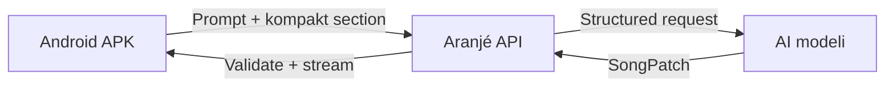

# ARANJÉ — Konsolide Ürün ve Spec Kararları

Sürüm: 1.2 karar özeti · Revizyon 1  
Tarih: 18 Ağustos 2026  
Durum: Faz 0 öncesi konsolidasyon  
İlke: **KISS — Keep It Simple and Stupid**

Bu belge; ilk pilot spec'ini, revizyon notunu, çalışan prototipten çıkan
bulguları ve sonraki ürün konuşmalarındaki kararları tek yerde toplar. Eski
belgeleri silmez; Faz 0'dan önce hazırlanacak güncel build spec'inin karar
kaynağıdır.

---

## 1. Tek cümlelik ürün

Aranjé, kullanıcının telefonda bir şarkıyı dinleyip bölüm bölüm görmesini,
doğal dille yeni bir pasaj istemesini ve AI önerisini dinleyerek kabul veya
reddetmesini sağlayan mobil müzik copilot'udur.

Pilotun kanıt cümlesi:

> Telefonumda, gerçek enstrüman benzeri seslerle çalan bir şarkıya doğal dille
> yeni bir pasaj eklettim; dinledim ve kabul ettim.

Pilot bir DAW, tam tab editörü veya otomatik stüdyo değildir.

---

## 2. KISS kuralları

1. Ana ekranda aynı anda yalnızca bir ana iş yapılır: dinle, bölüm seç veya AI'a
   komut ver.
2. Kullanıcı aynı anda en fazla 6 aktif track kullanır; katalogda 10 enstrüman
   olması ekranda 10 enstrüman gösterileceği anlamına gelmez.
3. Gelişmiş ayarlar ana ekranda durmaz; ihtiyaç halinde bottom sheet açılır.
4. Pilot yalnızca ürünün temel döngüsünü kanıtlayan özellikleri içerir.
5. İleri özellikler ana ekranı şişirmez; pilotta gerekliyse bottom sheet veya
   ayrı ayrıntı ekranında açılır.
6. Kullanıcı bir özelliği anlamak için müzik teorisi bilmek zorunda değildir.
7. AI çıktısı hiçbir zaman doğrudan şarkıya yazılmaz; önce pending öneri olur.
8. Sesin birebir stüdyo kaydı olması gerekmez; nota, ritim, akort ve çalınabilirlik
   doğru olmalıdır.

---

## 3. Pilot kapsamı

### 3.1 Pilotta zorunlu

- Mobil öncelikli tek sayfa web uygulaması.
- En fazla 6 eşzamanlı aktif track.
- En fazla 64 toplam bar; section başına 1–8 bar.
- Bir AI ekleme/değiştirme işlemi en fazla 8 bar üretir.
- 4/4, 3/4, 6/8 ve 7/8 ölçü preset'leri.
- Global BPM ve isteğe bağlı section BPM override.
- Sekizlik veya onaltılık grid resolution.
- Gerçek sample tabanlı melodik sesler ve davul.
- 10 enstrüman ailesinden oluşan Core Lite katalog.
- Enstrüman başına en az 2 varyasyon; bazı varyasyonlar aynı sample seti
  üzerinde güvenli efekt preset'i olabilir.
- Play/stop, section seçimi, bar highlight ve section loop.
- Prompt → patch → validation → pending → dinle → kabul/ret döngüsü.
- E Standard ve Drop D gitar preset'leri.
- Davulda aynı slotta birden fazla parçaya vurabilme.
- Temel velocity ve sınırlı articulation desteği.
- localStorage kalıcılığı ve son karar geçmişi.
- Distortion/WaveShaper desteği.

### 3.2 Pilotta gelişmiş ayarlar

- 6/7/8 telli gitar ve 4/5/6 telli bas seçimi.
- Akort preset'leri: E Standard, Eb Standard, D Standard, Drop D, Drop C,
  Open G, 7-string B Standard ve 7-string Drop A.
- Tel tel manuel akort: her tel için nota seçme veya yarım ses artır/azalt.
- Enstrüman sınırları içinde tel ekleme/çıkarma ve capo 0–12.
- Genişletilebilir davul kit parçaları.
- 4/4, 3/4, 6/8, 7/8 ölçü ve section tempo ayarı.
- Temel articulation seti.
- Track pan, mute ve solo.

Bu kontroller pilottadır fakat ana ekranda değildir. Gitar/bas için “Akort”,
davul için “Kit parçaları”, genel track ayarları için “Mixer” bottom sheet'i
kullanılır. Ayrıntılı DAW mixer'i ve tempo automation lane'i yapılmaz.

Audio import kaynak/güven metadatası şemada bulunur; tam ses dosyası analiz
özelliği pilot sonrası ilk deney olarak kalır.

### 3.3 Pilot sonrası

- alphaTab veya tam tab/nota görünümü.
- Tam manuel nota editörü.
- Tam şarkı ses dosyasından çoklu enstrüman transkripsiyonu.
- WAV/MP3 render ve gelişmiş export.
- Auth, cloud sync, paylaşım ve işbirliği.
- React Native ile baştan yazılmış ayrı native istemci.
- Topluluk stil kartları.
- Kullanıcı zevkini uzun vadeli öğrenme.
- Gelişmiş mixer ve geniş efekt zinciri.

---

## 4. Mobil bilgi mimarisi

Ana ekran üç sabit bölgeden oluşur:

| Bölge | Her zaman görünenler | Gizlenenler |
|---|---|---|
| Üst bar | Şarkı adı, geri/menü | Dosya, import, ayarlar |
| İçerik | Section timeline, seçili section özeti | Nota/fret/drum ayrıntısı |
| Alt dock | Play/stop, mevcut bar, “Ne ekleyelim?” | AI seçenekleri, mixer |

### 4.1 Ana ekran

- Section'lar yatay kaydırılır.
- Her section kartında ad, durum, bar sayısı ve küçük üç şeritli önizleme olur.
- Önizleme: gitar/üst melodik track, bas/alt melodik track ve davul grid'i.
- Kart yüksekliği yaklaşık 100–120 px tutulur.
- Kart üzerindeki noktalar editör değil, yalnızca müzikal konturdur.
- Bir karta dokunmak ayrıntı bottom sheet'ini açar.

### 4.2 AI komutu

- Dev bir sohbet alanı sürekli açık durmaz.
- Alt dock'taki “Ne ekleyelim?” alanına dokununca AI bottom sheet'i açılır.
- Sheet'te yalnız prompt, isteğe bağlı stil seçimi ve “Üret” bulunur.
- Geçmiş konuşma ana ekranda yer kaplamaz; menüden açılır.

### 4.3 Pending öneri

- Pending kart kesikli bronz çerçeve ve hafif breathe animasyonu kullanır.
- Pending section seçiliyken ekranın altında tek karar çubuğu görünür:
  “Dinle”, “Kabul”, “Ret”.
- Üç buton da en az 44 px dokunma hedefidir.
- Ret sırasında prototipteki kısa scale-out animasyonu korunur.

### 4.4 Track ve enstrüman yönetimi

- Ana ekranda sürekli mixer gösterilmez.
- Track başlığına dokununca Track Settings bottom sheet'i açılır.
- Burada enstrüman, varyasyon, volume, pan, mute/solo ve gitar/bassa tuning
  seçilir.
- “Enstrüman değiştir” ekranı kategori + arama + son kullanılanlar şeklindedir.
- Şarkıda en fazla 6 aktif track bulunur. Ana timeline section kartında bütün
  track'leri ayrıntılı göstermeye çalışmaz; melodik üst katman, bas katmanı ve
  ritim özeti gösterir. Ayrıntı ekranında track listesi dikey kayar.
- Akort ekranında önce preset'ler görünür. “Elle düzenle” açıldığında teller
  kalından inceye listelenir; nota değiştirilebilir ve tel eklenip çıkarılabilir.

### 4.5 Davul yönetimi

- Davul editörü ilk açılışta kick, snare ve hi-hat gösterir.
- “Parça ekle” bottom sheet'i ile ride, crash, china ve tom lane'leri açılır.
- Parça eklemek yeni track oluşturmaz; aynı drum kit içindeki lane'i gösterir.

Bu düzenle geniş özellik seti mobil ekrana taşmaz; ana yüzey basit kalır,
ayrıntı kullanıcı istediğinde açılır.

### 4.6 APK dağıtımı

- Pilot yalnız web linki olarak kalmaz; Android'e kurulabilir APK üretilir.
- Next.js istemcisi statik export edilir ve Capacitor Android kabuğuna alınır.
- Timeline, ses motoru, Core Lite sample'ları ve yerel projeler APK içinde veya
  cihaz cache'inde çalışır.
- AI anahtarı APK'ya gömülmez. Copilot istekleri uzaktaki güvenli backend'e
  gider.
- İnternet yokken playback, manuel düzenleme ve kayıtlı projeler çalışır; AI ve
  online analiz özellikleri bağlantı ister.
- Pilot testinde imzalı APK, mağaza yayınında aynı projeden Android App Bundle
  (AAB) üretilir.
- React Native veya ayrı native ses motoru ancak WebView performansı ürün
  hedeflerini karşılamazsa pilot sonrasında değerlendirilir.

Teknik dayanaklar: Next.js statik export
<https://nextjs.org/docs/app/guides/static-exports>, mevcut web uygulamasına
Capacitor ekleme <https://capacitorjs.com/docs/getting-started> ve Android
uygulama paketi <https://developer.android.com/guide/app-bundle>.

---

## 5. Görsel dil — Dark Workshop

İlk prototipin sıcak/karanlık karakteri korunur fakat arayüz “editoryal poster”
yerine modern bir müzik aleti gibi davranır. Bronz her yerde kullanılan dekor
değil, AI ve yaratıcı müdahale rengidir.

### 5.1 Renk rolleri

- Uygulama zemini: `#101114`
- Panel: `#181A1F`
- Yükseltilmiş panel: `#202329`
- Çizgi/grid: `#30343C`
- Ana metin: `#F0ECE4`
- Soluk metin: `#9CA2AC`
- Playback/aktif seçim çeliği: `#7FA7B8`
- AI/pending bronzu: `#C58A3A`
- Kabul yeşili: `#56866A`
- Ret/hata kırmızısı: `#B55E57`

Renkler semantiktir: çelik çalan/seçili, bronz AI önerisi, yeşil kabul, kırmızı
geri döndürülemez veya hatalı durumdur. Enstrümanları sürekli farklı renklere
boyamak yerine küçük ikon/etiketlerle ayırırız.

### 5.2 Tipografi ve biçim

- Fraunces yalnız marka, onboarding ve büyük boş durum cümlelerinde kullanılır.
- Editör, sayı, süre, akort ve kontrollerde Inter kullanılır.
- İtalik bronz metin dekor olarak tekrarlanmaz.
- Köşeler orta yuvarlaklıkta, çizgiler ince, gölgeler minimumdur.
- Dokunma hedefleri en az 44 px; kritik transport 48–52 px olabilir.
- Fontlar `next/font` ile self-host edilir.
- Animasyonlarda `prefers-reduced-motion` desteği bulunur.

Section rengi ayrı bir `kind` alanından değil durumdan ve baskın
enstrüman/preset metadata'sından türetilir. Ana kullanımda durum renkleri
enstrüman renginin önüne geçer.

---

## 6. Düzeltilmiş sembolik müzik modeli

### 6.1 Enstrüman registry

Track içine kapalı bir enstrüman enum'u gömmek yerine registry kullanılır:

```ts
type Track = {
  id: string;
  instrumentId: string;       // "electric_guitar"
  presetId: string;           // "high_gain"
  volumeDb: number;
  pan?: number;
  fretboard?: {
    tuning: string[];         // kalından inceye
    capo: number;
  };
};
```

Tel sayısı `tuning.length` değeridir. Örnekler:

```ts
const E_STANDARD = ["E2", "A2", "D3", "G3", "B3", "E4"];
const DROP_D     = ["D2", "A2", "D3", "G3", "B3", "E4"];
const BASS_5     = ["B0", "E1", "A1", "D2", "G2"];
```

### 6.2 Melodik nota

```ts
type Articulation =
  | "normal"
  | "palm_mute"
  | "accent"
  | "sustain"
  | "staccato";

type NoteEvent = {
  pitch: string;
  velocity?: number;          // 1–127; yoksa preset varsayılanı
  articulation?: Articulation;
  position?: {
    string: number;
    fret: number;
  };
};

type MelodicSlot = null | "-" | {
  notes: NoteEvent[];         // bir nota veya akor
};
```

`null` sus, `"-"` önceki olayı uzatan tie'dır. Birden fazla `NoteEvent` akor
oluşturur. `position` yoksa tuning-aware pozisyon motoru hesaplar.

Pozisyon motoru şu maliyetleri minimize eder:

- Büyük perde sıçraması.
- Gereksiz tel değişimi.
- İnsan eliyle basılamayan akor açıklığı.
- Stil dışı pozisyon.

Kullanıcının yaptığı tel/perde seçimi AI hesabının üzerine yazılır ve korunur.

### 6.3 Davul olayı

```ts
type DrumPiece =
  | "kick"
  | "snare"
  | "closed_hat"
  | "open_hat"
  | "ride"
  | "crash"
  | "china"
  | "tom_high"
  | "tom_mid"
  | "tom_floor";

type DrumHit = {
  piece: DrumPiece;
  velocity?: number;
  articulation?: "normal" | "ghost" | "accent";
};

type DrumSlot = DrumHit[];
```

Boş dizi sus anlamına gelir. Aynı slotta kick + hat + crash mümkündür.

### 6.4 Bar

`subdivision` yerine nota grid'ini doğru ifade eden `resolution: 8 | 16`
kullanılır. Slot sayısı ölçüye göre türetilir:

```ts
type TimeSignature = [4, 4] | [3, 4] | [6, 8] | [7, 8];

type Bar = {
  timeSignature: TimeSignature;
  resolution: 8 | 16;
  bpmOverride?: number;
  // trackId -> slot dizisi
};

const slotCount = numerator * resolution / denominator;
```

Örnek: 4/4 + sekizlik resolution = 8 slot; 6/8 = 6 slot; 7/8 = 7 slot.
Canonical model ayrıntılı kalabilir; modele gönderilen içerik §11'deki kompakt
serializer ile küçültülür.

### 6.5 Ölçü ve tempo

Pilot 4/4, 3/4, 6/8 ve 7/8 preset'lerini çalar. Varsayılan 4/4'tür. Tempo
şarkı seviyesinde tanımlanır; section/bar `bpmOverride` yalnız kullanıcı açıkça
değiştirdiğinde bulunur. Görsel tempo automation lane'i yapılmaz.

---

## 7. Core Lite enstrüman paketi

| # | Enstrüman | Başlangıç varyasyonları | Motor |
|---:|---|---|---|
| 1 | Elektro gitar | Clean, crunch, high-gain | Sample + Filter/Distortion |
| 2 | Çelik telli akustik | Finger, pick | Sample |
| 3 | Klasik/nylon gitar | Warm, bright | Sample |
| 4 | Elektro bas | Finger, pick, driven | Sample + Filter/Distortion |
| 5 | Davul | Rock, metal, electronic | Sample kit |
| 6 | Piyano | Grand, upright | Sample |
| 7 | Elektrikli piyano | Soft, bright | Sample |
| 8 | Organ | Rock, church | Sample veya güvenli synth |
| 9 | Strings ensemble | Sustain, staccato | Sample |
| 10 | Synth | Lead, warm pad, dark pad | PolySynth(Synth) |

“Varyasyon” her zaman ayrı sample seti demek değildir. Elektro gitar ve basın
bazı varyasyonları aynı temiz sample'lardan Filter, Gain ve prototipte
doğrulanmış Distortion/WaveShaper ile üretilebilir. Farklı çalım tekniği
gerektiren finger/pick veya sustain/staccato ise mümkün olduğunda ayrı sample
kullanır.

### 7.1 Yükleme stratejisi

- Uygulama açılırken bütün katalog indirilmez.
- Yalnız aktif şarkının kullandığı enstrüman/preset paketleri yüklenir.
- İndirilen dosyalar Cache Storage veya IndexedDB'de tutulur.
- Demo şarkısının ilk ses yükü yaklaşık 8 MB hedefinde kalır.
- Tüm katalog için tek bir 8 MB hard limit uygulanmaz.
- Üçüncü taraf sample URL'lerine runtime hotlink yapılmaz.
- Lisansı uygun dosyalar optimize edilip sürümlü olarak kendi origin/CDN'imizden
  sunulur.

### 7.2 Lisans politikası

Öncelik sırası:

1. CC0 / public domain.
2. Ticari yeniden dağıtıma açık, atıf şartlı CC BY.
3. Açıkça izin alınmış özgün kayıtlar.

CC BY-NC, belirsiz lisans veya yalnız “kişisel kullanım” izni bulunan sesler
ürüne alınmaz.

Her sample/paket için kaynak URL, üretici, lisans, orijinal dosya adı,
işlenmiş dosya adı ve checksum manifestte saklanır.

Başlangıç kaynak adayları:

- VCSL — CC0 genel amaçlı sample kütüphanesi:
  <https://github.com/sgossner/VCSL>
- VSCO 2 Community Edition — CC0 orkestral sample'lar:
  <https://versilian-studios.com/vsco-community/>
- tonejs-instruments — sample'lar CC BY 3.0; atıf ve kaynak kontrolü zorunlu:
  <https://github.com/nbrosowsky/tonejs-instruments>

CC0 ticari kullanım, değiştirme ve yeniden dağıtıma izin verir; yine de kaynak
provenance'i içeride tutulur:
<https://creativecommons.org/publicdomain/zero/1.0/deed.en>

---

## 8. Ses motoru kararları

### 8.1 İzin verilen zincir

- Sampler
- PolySynth(Synth)
- MembraneSynth
- NoiseSynth
- Filter
- Distortion/WaveShaper
- Gain/Channel
- Destination
- Meter

Distortion prototipte mobil saha testinde çalışmıştır ve metal karakteri için
gereklidir. Spec'teki eski Distortion yasağı kaldırılır.

### 8.2 Yasak/ertelenen node'lar

- Reverb / Freeverb
- PluckSynth
- FMSynth
- Convolver
- AudioWorklet tabanlı özel zincirler

Bu yasak sonsuza kadar değildir; pilotun mobil ses kanıtını korur.

### 8.3 Scheduling

- Bütün ses zamanlaması `Tone.Transport` nota değerleriyle yapılır.
- Mutlak saniye aritmetiği kullanılmaz.
- BPM scheduling başlamadan önce ayarlanır.
- UI highlight, Transport callback zamanı kullanılarak `Tone.Draw.schedule`
  üzerinden çizilir.
- `Tone.start()` yalnız kullanıcı jestinde çağrılır.
- Her track ayrı Channel'a, bütün kanallar tek master Gain'e bağlanır.
- `?debug=1` modunda track metreleri gösterilir.

---

## 9. Mini-tab kararı

Prototipteki altı çizgi ve normalize nota noktaları gerçek tab değildir.
Güncel yaklaşım:

- Her track için ayrı mini şerit.
- Gitar 6/7/8 tel sayısına göre çizgi.
- Bas 4/5/6 tel sayısına göre çizgi.
- Davul başlangıçta 3 lane grid; ek parçalar yalnız ayrıntıda görünür.
- Nota yüksekliği section min/max'ına göre değil enstrüman aralığına veya
  hesaplanmış gerçek string/fret pozisyonuna göre çizilir.
- Bar bölücüleri section bar sayısına göre dinamik oluşturulur.
- Önizleme editör değil, section konturudur.

---

## 10. Validator kararları

Her sonuç `severity: "error" | "warning"` taşır.

Hard error:

- Schema shape.
- Bar slot uzunluğu.
- Enstrüman nota aralığı.
- Davul vocabulary.
- Geçersiz string/fret/tuning ilişkisi.
- Aynı telde çalınması imkânsız eşzamanlı notalar.
- Maksimum 6 aktif track, 64 toplam bar, section başına 1–8 bar.
- Tek AI patch'inde en fazla 8 yeni/değişen bar.
- Ölçü ve resolution'a göre yanlış slot sayısı.
- Bir bardaki melodik notaların %50'den fazlasının izinli tonal küme dışında
  olması.

Warning:

- İzinli tonal küme dışındaki tekil nota.
- Olağandışı ama çalınabilir fret sıçraması.
- Çok düşük/yüksek velocity.
- Eksik position nedeniyle otomatik yerleştirilen gitar notası.

Tonal küme doğal/armonik/melodik minör, majör ödünçleri, b5 ve komşu kromatik
geçişleri destekler. Tek bir “renk notası” patch'i engellemez.

---

## 11. AI copilot ve maliyet

### 11.1 Model kararı

Build tek bir sağlayıcı/model adına kilitlenmez. Model adları env/config'ten
okunur:

```txt
ARANJE_MODEL_DEFAULT
ARANJE_MODEL_ESCALATION
```

Default model kararı Faz 2'de küçük bir müzikal eval setiyle verilir. Eval;
yalnız JSON geçerliliğini değil, tekrar, motif gelişimi, çalınabilirlik, groove
ve kullanıcı tercihine uygunluğu ölçer. Faz 0 ve Faz 1 bu kararı beklemez.

### 11.2 Token ekonomisi

- Modele ham Song JSON gönderilmez.
- Yalnız hedef section, bir önceki ve bir sonraki section ile tek satır meta
  gönderilir.
- Sabit prompt + schema + stil kartı byte-sabit cache bloğudur.
- Structured output/tool-use zorunludur.
- Düzeltme turu en fazla 2'dir.
- Kullanım ve tahmini maliyet loglanır.
- Aylık kota → ucuz model → günlük mini hak → kapalı zinciri uygulanır.

Örnek kompakt gösterim:

```txt
gtr: E2 E2 . G2 - - A2 G2
drm: K+H H S+H H K+H H S+H H
```

Canonical model ayrıntılı, AI taşıma formatı kompakt kalır.

### 11.3 Müzikal kalite

“Ruh” yalnız daha pahalı modelden gelmez. Çıktı kalitesinde şu katmanlar
birlikte değerlendirilir:

- Stil kartının somut örnekleri.
- Motifin section'lar arasında devamı.
- Velocity ve articulation.
- Akor voicing'i ve gitar çalınabilirliği.
- Groove/humanization.
- Kullanıcının kabul/ret geçmişi.

### 11.4 AI agent telefonda nasıl çalışır?

Pilot APK içinde büyük model veya gizli API anahtarı çalışmaz. Telefon müzik
editörü ve ses motorudur; copilot döngüsü güvenli backend'de çalışır.



Akış:

1. APK hedef section ve komşularını kompakt formatta backend'e gönderir.
2. Backend kullanıcı kotasını ve isteği kontrol eder.
3. Model yalnız tanımlı `CopilotPatch` şemasında öneri üretir.
4. Backend Zod + müzik validator'larını çalıştırır; gerekirse en fazla iki
   düzeltme turu yapar.
5. APK gerçek durum olaylarını alır: `generating`, `validating`, `retrying`,
   `done` veya `failed`.
6. Son patch telefonda tekrar doğrulanır ve pending olarak gösterilir.
7. Kullanıcı kabul etmeden canonical Song değişmez.

KISS gereği pilotta çoklu otonom agent kurulmaz. Tek, sınırlandırılmış copilot
akışını backend kodu yönetir. Daha sonra audio analysis gibi uzun işler ayrı
background job olabilir. İnternet yoksa AI düğmesi bunu açıkça söyler; manuel
editör ve playback çalışmaya devam eder.

Bu seçim, OpenAI'nin doğrudan kontrol edilen özel döngüler için Responses API;
SDK'nın döngüyü yönettiği tekrarlı/çok adımlı işler için Agents SDK ayrımına da
uyar: <https://developers.openai.com/api/docs/guides/agents>.

### 11.5 Güvenlik ve gecikme

- Model sağlayıcı anahtarı APK'ya veya JavaScript bundle'a konmaz.
- İstekler kullanıcı/cihaz kotası, rate limit ve maksimum patch boyutuyla
  sınırlandırılır.
- Server-Sent Events ile gerçek işlem aşamaları gösterilir; sahte ilerleme
  mesajı üretilmez.
- Aynı prompt/section hash'i için kısa süreli cache kullanılabilir.
- AI sağlayıcısı değişse bile telefonun `CopilotPatch` sözleşmesi değişmez.

API anahtarını güvenli backend'de tutma ve harcama limitleri:
<https://developers.openai.com/api/docs/guides/production-best-practices>.
SSE streaming davranışı:
<https://developers.openai.com/api/docs/guides/streaming-responses>.

---

## 12. Monetizasyon yolu

### 12.1 Pilot ve doğrulama

- Kapalı pilot ücretsizdir; ödeme entegrasyonu ürün kanıtını geciktirmez.
- Pilot boyunca istek başına gerçek AI maliyeti, kabul oranı, haftalık geri
  dönüş ve üretilen/kabul edilen bar sayısı ölçülür.
- Ücret koymadan önce kullanıcıların AI önerisini gerçekten kabul edip tekrar
  gelip gelmediği kanıtlanır.

### 12.2 İlk ticari model: Free + Pro

Reklam kullanılmaz. Başlangıçta yalnız iki seviye bulunur:

| Free | Pro abonelik |
|---|---|
| Manuel editör ve playback | Aylık dahil AI üretim kotası |
| Core Lite enstrümanları | Daha yüksek proje/AI kotası |
| Preset + manuel tuning | MIDI ve daha sonra audio import dakikaları |
| Sınırlı yerel proje | Cloud sync ve export özellikleri |
| Küçük deneme AI hakkı | Öncelikli/yüksek kalite model yükseltmesi |

Temel akort, tel düzenleme ve Core Lite sesleri ücret duvarının arkasına
konmaz; bunlar ürünün güven veren çekirdeğidir. Değişken maliyet yaratan AI,
audio analysis, cloud ve export Pro değerini oluşturur.

“Sınırsız AI” sözü verilmez. Aboneliğe aylık hak dahildir; biterse sonraki ayı
bekleme veya ileride Play Billing üzerinden ek kredi paketi seçeneği sunulur.
Kesin fiyat ve kota, pilot metering verisi görülmeden sabitlenmez.

### 12.3 Mağaza ve ödeme

- Sideload APK beta ücretsiz kalabilir.
- Google Play üzerinden dağıtılan uygulamada satılan dijital özellik ve
  abonelikler için geçerli mağaza kurallarına göre Google Play Billing
  kullanılır.
- Satın alma yalnız cihazda güvenilir sayılmaz; backend purchase token'ını
  doğrular ve entitlement üretir.
- Ticari beta başladığında basit auth gerekir; üyelik ve AI kotası localStorage
  ile korunamaz.
- İlk ödeme ürünü aylık/yıllık Pro aboneliğidir. Tek tek premium sound pack ve
  karmaşık üç-dört plan sonraya bırakılır.

Google Play dijital özellik ve aboneliklerde genel olarak Play Billing ister:
<https://support.google.com/googleplay/android-developer/answer/10281818>.
Satın alma akışı ve server-side doğrulama rehberi:
<https://developer.android.com/google/play/billing/integrate>.
Mağaza hizmet oranları ülke/program/tarih koşullarına göre değişebildiği için
fiyatlandırma öncesi güncel tablo tekrar doğrulanır:
<https://support.google.com/googleplay/android-developer/answer/112622>.

### 12.4 Birim ekonomi kuralı

Pro kotası şu eşitsizliği koruyacak şekilde belirlenir:

```txt
net abonelik geliri
- mağaza/ödeme payı
- ortalama AI ve audio analysis maliyeti
- depolama/transfer
- destek payı
> hedef brüt kâr
```

Model escalation yalnız zor isteklerde çalışır. Cache, kompakt bağlam ve patch
boyutu sınırı doğrudan marj koruma mekanizmasıdır.

---

## 13. Şarkı içe aktarma

İki farklı özellik birbirinden ayrılır:

### 13.1 Şarkıyı tanı

Chromaprint benzeri fingerprint şunlar için kullanılır:

- Aynı veya çok benzer kaydı tanımak.
- Duplicate analizi önlemek.
- Önceden çıkarılmış sonucu cache'ten getirmek.
- Kendi kataloğumuzda kayıt/sürüm eşleştirmek.

Fingerprint nota veya tab çıkarmaz ve referans fingerprint veritabanı olmadan
şarkı adını kendiliğinden bilemez.

### 13.2 Şarkıyı içe aktar

Önerilen aşamalar:

1. MIDI import — en güvenilir ve ucuz ilk adım.
2. 20–60 saniyelik tek gitar/bas kaydı → audio-to-MIDI → fret mapping.
3. Deneysel tam miks → stem separation → çoklu track transkripsiyonu.
4. Ürün tutarsa uzun şarkı, GPU job queue ve gelişmiş transkripsiyon.

Tam miks ve distorsiyonlu metal gitar sonucu kusursuz tab değil, güven skorları
olan düzenlenebilir taslak olarak sunulur.

Referans şarkıdan yeni düzenleme istenirse ham melodiyi kopyalamak yerine şu
profil çıkarılır:

```txt
BPM + tonalite + ölçü + bölüm yapısı + akor ritmi + enerji eğrisi
+ enstrüman yoğunluğu
```

Bu profil özgün SongPatch üretimine rehber olur.

---

## 14. Pilot fazları

### Faz 0 — Temel ve model

- Next.js, TypeScript strict, Tailwind, Zod, Vitest.
- Güncel Song/Track/Event şeması.
- Instrument registry ve preset metadata.
- 4/4, 3/4, 6/8, 7/8; 8/16 resolution; tuning ve davul multi-hit
  validator'ları.
- Örnek metal şarkı ve mobil boş/özet timeline.
- Prototip `design/prototype.html` olarak yalnız referans.

### Faz 1 — Ses ve sade mobil editör

- Kullanılan aktif enstrümanların lazy sample yüklemesi.
- Distortion dahil güvenli ses zinciri.
- Play/stop, bar highlight ve section loop.
- Section timeline, mini şeritler ve bottom sheet'ler.
- Track preset seçimi; preset + tel tel manuel tuning; tel ekle/çıkar; capo.
- Davul parça lane yönetimi; track pan, mute ve solo.
- Debug metreleri.

### Faz 2 — Copilot

- Provider-agnostic `/api/copilot`.
- Structured patch, validator ve en fazla iki düzeltme turu.
- Pending section, dinle, kabul ve ret.
- İki stil kartı.
- Küçük müzikal model eval'i ve default/escalation seçimi.
- Rate limit, pilot token ve maliyet metering.

### Faz 3 — Cila

- Ret animasyonu ve reduced-motion.
- Son 10 karar geçmişi.
- Sample loading/error/offline durumları.
- Lighthouse mobile performance hedefi.
- MIDI import için hazırlık veya zaman kalırsa ilk sürüm.
- Next.js static export + Capacitor Android projesi.
- En az iki gerçek Android telefonda audio regression testi.
- Telefona kurulabilen imzalı pilot APK.

### Pilot sonrası ilk deney

- Tek enstrümanlı 20–60 saniye audio import.
- Tuning-aware otomatik tab taslağı.

---

## 15. Teknik kararların kısa listesi

- Tone.js tam sürüm pinlenir: `14.8.49`.
- Audio modülleri yalnız client'ta ve SSR dışında yüklenir.
- Sample'lar runtime üçüncü taraf CDN'inden çekilmez.
- Sample kaynak/lisans manifesti zorunludur.
- Distortion izin listesine eklenir.
- Reverb/Freeverb/PluckSynth/FMSynth/Convolver/AudioWorklet pilotta yasaktır.
- `Bar.resolution` 8 veya 16'dır; slot sayısı ölçüden türetilir.
- `null` sus, `"-"` tie'dır.
- Davul slotu `DrumHit[]` biçimindedir.
- Gitar/bas tuning dizisi tel sayısının kaynağıdır.
- Track `instrumentId + presetId` kullanır.
- Section rengi baskın instrument/preset'ten türetilir; `kind` eklenmez.
- Bar ayraçları dinamik, track mini şeritleri ayrıdır.
- localStorage parse hatası uygulamayı çökertmez; bozuk veri yedeklenir.
- Kullanıcıya görünen marka “Aranjé”, teknik isimler ASCII `aranje` olur.
- AI model seçimi config'ten gelir ve Faz 2 eval'iyle belirlenir.
- Pilot istemcisi Capacitor ile Android APK olarak paketlenir.
- AI anahtarı APK'ya gömülmez; copilot backend'de çalışır.
- Maksimum 6 aktif track, 64 toplam bar ve AI patch başına 8 bar sınırı vardır.

---

## 16. Şimdilik özellikle yapmayacağımız şeyler

KISS'i korumak için aşağıdakiler ana pilot kapsamına alınmaz:

- Ana ekranda sürekli açık mixer.
- Ana ekranda sürekli açık chatbot geçmişi.
- 10 enstrümanın hepsini aynı anda aktif track olarak eklemek.
- Tam gitar tab editörü.
- Tek tek waveform düzenlemek.
- Tam şarkı upload ve kusursuz otomatik tab sözü vermek.
- Efekt pedalboard'u.
- Çok kullanıcılı hesap sistemi.
- Cloud proje yönetimi.
- React Native ile ayrı bir uygulamayı baştan yazmak.
- Telefonda büyük AI modeli veya çoklu otonom agent çalıştırmak.
- Ayrıntılı DAW mixer'i ve tempo automation lane'i.

---

## 17. Faz 0'a geçiş kapısı

Faz 0 ancak aşağıdakiler güncel build spec'ine işlendiğinde başlamalıdır:

- [ ] Distortion yasağı kaldırıldı ve izin listesine eklendi.
- [ ] Instrument/preset registry eklendi.
- [ ] Tuning/string/fret modeli eklendi.
- [ ] Davul multi-hit modeli eklendi.
- [ ] Velocity ve sınırlı articulation eklendi.
- [ ] Core Lite 10 enstrüman listesi ve lazy-load politikası eklendi.
- [ ] Mobil bottom-sheet bilgi mimarisi eklendi.
- [ ] 6 aktif track / 64 toplam bar / patch başına 8 bar sınırı işlendi.
- [ ] Akort preset'leri + tel tel manuel düzenleme + tel ekle/çıkar UI'si işlendi.
- [ ] 3/4, 6/8, 7/8 ölçü preset'leri ve resolution modeli işlendi.
- [ ] Capacitor APK hedefi Faz 3 kabul kriterine eklendi.
- [ ] Model seçimi provider-agnostic config + Faz 2 eval olarak güncellendi.
- [ ] Telefon → backend → model → validated patch mimarisi işlendi.
- [ ] Free + Pro abonelik ve kota temelli monetizasyon yolu işlendi.
- [ ] Audio import pilot sonrası deney olarak yazıldı.
- [ ] Eski 8 MB toplam katalog sınırı, ilk şarkı yükü hedefi olarak düzeltildi.

Bu kapı geçildikten sonra ürün kapsamı yeterince net ve KISS ile uyumludur.
